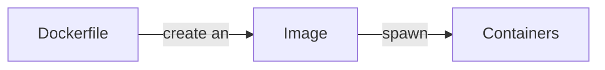
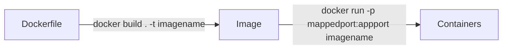

# Docker

## The Problem
- Deploying and maintaining applications is very difficult
  - You need to build your application into a usable format
    - .jar for Java
  -  You need an environement set up that can run your code
     -  installing the correct JDK, or version of python on the computer
     -  Setting up environment variables
     -  specific folder or file structure
-  **Well it works on my machine**
- **The solution** 
  - Bundle the application and environment it runs in into a single artifact
    - That artifact is called a **Container**

## Docker Basics
- Containerization software
- **Container**
  - A virtual environment for an application to run in
  - Are very lightweight
    - Making and creating containers is on the order of seconds
  - A container runs on a computer like any other program
    - running a container is fundamentally the same to your computer as having microsoft word open
- **Image**
  - A template for a container
  - Image is to container as class is to object
- **Dockerfile**
  - A script that will create an image

### Docker lifecycle


### Docker lifecycle (commands)

- ***Dockerhub***
  - Huge repository for docker images
  - As github is to source code dockerub is to images


### Containers vs VMs

- Virtual Machines are full fleged computers
  - The hardware specs are just virtual
  - Being assigned ram and VPCs from a physical computer
  - Have their own Operating system
- Containers are lightweihgt prcoesses on a machine
  - They run just like a regular computer for the OS
  - Containers run on top of an operating system

### Example Dockerfile
```dockerfile
FROM openjdk 
# specify what the environment in my container should be

COPY . /workspace
# copy all files in the current folder and put them in a folder called workspace in the virtual environment when created

WORKDIR /workspace
# Any commands we run in our dockerfile will exucute from that location

EXPOSE 8080
# We specify what port our application runs on

ENTRYPOINT [ "java", "-jar", "Hello-App-1.0-SNAPSHOT.jar" ]
# What command will be used to to start my application
```