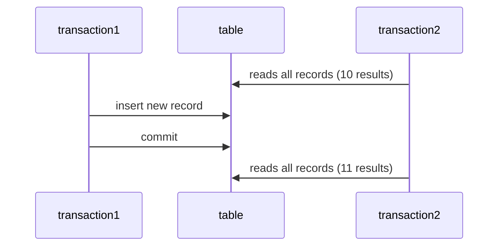
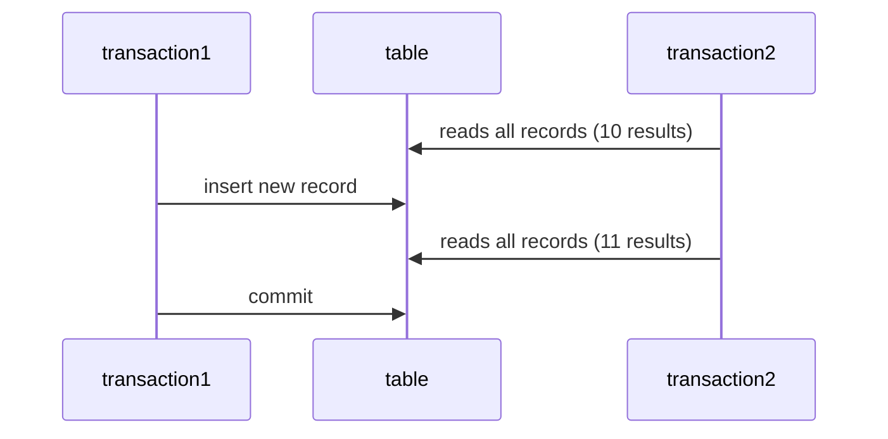

# Database
- A program that saves information
  - The information is saved in a **persistent format**
  - If you turn off the power the data will persist, it will not be destroyed
  - persistent data storage types
    - hard disk
    - Magnetic tape
    - Cuneiform tablet
- Tons of different paradigms of databases
  - NoSQL
    - Data is stored in semi-structured non strict ways
      - Documents (MongoDB)
  - SQL
    - **Relational Database**
    - Data is stored in tables that reference or relate to one another 

# SQL
- Structured Query Language
  - Programming language for **Relational Databases**
    - The early 1970s
  - DSL (Domain Specific Language)
    - Language designed to do one thing specifically
    - CSS is designed for styling web pages
- Dialects
  - postgresql
  - MySQL
  - Microsoft SQL Server
  - Oracle (yuck)
- Most versions of SQL are not case sensitive for commands
  - the names of tables are case sensitive
  - but there is no standard
  - ***KEEP YOUR CODE CONSISTENT***
  - Tables should be named in the singular
    - The table name reflects what each individual record is
- **Table**
  - **Rows/records**
    - Horizontal rows
  - **Columns/attributes**
    - Vertical columns


|associate_id| first_name | last_name | state |
|------------|------------|-----------|-------|
|101|Bill|Billson|New York|
|202|James|Sunderland| Maine|
|303|Hank|Hill|New York|

## Sub Languages of SQL
- **DDL**
  - **Data Defintion Language**
  - Commands for creating the **schema**
    - CREATE, DROP, ALTER
    - Schema is a technical term for the structure of your database
      - The tables and columns within those tables
- **DML**
  - **Data Manipulation Language**
  - Commands for editing the data within the table
    - DELETE, UPDATE, INSERT
- **DQL**
  - **Data Query Language**
  - SELECT
- **DCL**
  - **Data Control Language**
  - commands for editing permissions to a database
    - GRANT, REVOKE
- **TCL**
  - **Transaction Control Language**
  - Commands for making transactions
    - COMMIT, ROLLBACK

## Constraints
- Restrictions we can add to columns on a table
  - **Primary key**
    - combination of two keys Unique and not null
    - Put on a column that serves as a unique identifier for a record.
    - Typically put on a column that represents an ID
  - **Unique**
    - All values within the column must be unique
  - **NOT NULL**
    - Values cannot null within this column
  - **Check**
    - A conditional that must be met for the column
  - **DEFAULT** 
    - A default value if none is provided
- **Serial**
  - Not really a constraint
  - Does allow you to auto increment
  - Great for IDs


## Normalization
- This is the process of ***removing redundancy**** from a database/table
  - This not always a good thing
  - really normalized data can be difficult to work with

### 1NF
- A table has a primary key
  - Each record is uniquely identifiable
- There are no composite columns
  - The data in the column is atomic
  - cannot be broken down into more meaningful colums

denormalized data
|name|salary|
|----|------|
|Lebron James| 26000000|
|Steph Curry| 21000000|
|Steph Curry| 21000000|

normalized data
|id|first_name|last_name|salary|
|--|----------|---------|------|
|101|lebron|James|26000000|
|102|steph| curry| 21000000|
|103|steph| curry| 21000000|


### 2NF 
- A table that follows 1st normalized form
- No column is a **functional dependency**
  - A column cannot be calculated using values in another column

Not in second normalized form
|player_id| shots_attempted | shots_made | shooting_percentage|
|---------|-----------------|------------|--------------------|
|101| 200| 120| 60|


### 3NF
- It's already in 2NF
- No columns are transitive dependencies
  - A column cannot be found in another table

- NOT in 3rd normalized form
  - Puttin Hometown in the player table is redundant

##### Team Table
|team_id| name| hometown| mascot|
|-------|-----|---------|-------|
|101|Muttonchop Mountaineers|Morgantown|The Mountaineer|


##### Player Table
|player_id|fname|lname|hometown|t_id|
|---------|-----|-----|--------|----|
| 888| Adam | Ranieri| Morgantown| 101|

## Transations
- Discrete update units for a Relational Database
  - Not all databases are transaction based
- A transaction consists of 1 to many SQL statments
- Transactions should follow ACID properties

### ACID properties
- Atomic
  - All or none of the statements persist in the transaction
- Consistent 
  - No intermediary state where some of the sql statements persisted
- Isolated
  - Transactions can run in parallel
  - Transactions could run in serial
    - One after another and there would be 0 discrepancies ever
- Durable
  - Failures in a transaction do not cause data corruption


### Isolation Phenomena
- Phantom read
  - A transaction reads the same table and finds an extra record the second time from the start of a tranaxction

- Dirty read
  - A transaction reads uncommited data
  - Very few databases actually support this for transactions



## Relationships between Tables
- The core feature of a relational database is that tables can reference each other
- ***Foreign Keys*** are the way to connect 2 tables together
  - Foreign key goes on the many side of the table
    - The child table
  - Foregin key references a unique column in the parent table
- Multiplicities
  - 1 - 1 
    - Very Rare
    - Why is not just one table anyway????
  - 1 - many
    - 1 parent has many children
    - team - player
  - many - many
    - many parents connect to many children
    - player - game
    - This requires a join table

### Joins and Set Operators
- Beacuase data is spread across multiple tables it is necessary to combine tables to get a comprehensive view of your data.
- **Joins**
  - Horizontal combine table
  - Based on a join predicate that matches record
- **Set Operators**
  - Vertically stack two tables on top of each other
  - No join predicate 
  - same amout of columns and same datatype
```sql
select * from team left join player on player.t_id = team.team_id ; -- join

select fname,salary from player
union -- will stack the top table on top of the bottom table
select lname,t_id from coach;
```

### SQL clauses

```SQL
where -- filters records by a condition
order by -- asc or desc for how the records are returned
group by -- use by aggregate function for sectioning into groups
select avg(salary),name from player left join team on player.t_id = team.team_id group by name;
```

### Functions
- Postgres does have built in functions
- **Scalar**
  - Act on a single record
  - upper(), lower(), length()
- **Aggregate**
  - Act on a collection of records
  - sum(), avg(), min()
- You can write your own custom functions.