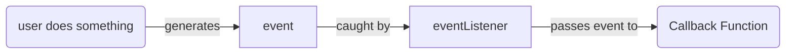

# Week 3 Review

## Browser Basics 
- Web Browsers are the most common computer application used by humans
- Web Browsers are desktop apps that serve as a a platform for web development
- There are 3 main features of any web browser
  - Render HTML/CSS
    - The visual aspect of any web page
  - JavaScript Engine
    - Executing JavaScript in the browser
  - HTTP Client
    - Ability to make HTTP requests
- A web site is just some files that have been quickly downloaded on your browser
  - ANYTHING on a web page can be edited and viewed by the user
  - NEVER put anything sensitive in your web pages

## Three Pillars of Client Side Tech
- **HTML**
  - HyperText Markup Language
  - Content and structure of a web page
- **CSS**
  - Cascading Style Sheets
  - Aesthetics and design of a web page
- **JavaScript**
  - Logic and dynamic capabilities of a web page
  - You click something and then something happens
- *Web Assembly*
  - 4th pillar
  - Assembly level code that is now supported in browsers

### Static Website Hosting
- Websites are just html/css/js files
  - Traditionally a webserver running on a computer would return an html file when you went to a specific route
    - /home => html file
- Cloud Services allow you to publicly host files
  - Allows you to easily host websites

## HTML
- **HyperText Markup Language**
- Content and structure of a web page
- ***NOT A PROGRAMMING LANGUAGE***
- Web Pages load from top to bottom
  - make sure to link CSS before applying the style in a style tag

### Syntax
- Tag/element based language
- Tags can have attributes
- Tags *can* be self closing
- Tags can be nested
- Should not be overlapping
- Required tags
  - Doctype
  - html root tag
    - head
    - body

```html
    <!-- <TagType>Content of the tag </TagType> -->
    <p>Hello I am a paragraph</p>
    <h1>I am a heading</h1>

    <!-- self closing tags -->
    <br/>
    <!-- src or any modifying withing the tag is an attribute -->
    

    <p>Hello my name is <b>Adam Ranieri</b><p>

        <!-- overlapping tags -->
    <p>Hello my
```

## CSS
- ***Cascading Style Sheets***
- Language responsible for adding style to web page
- ***NOT A PROGRAMMING LANGUAGE***
- **Cascade Alogorithm**
  - Determine the ultimate CSS applied to an element
  - Multiple CSS rules might apply to the same element
    - **The most specific CSS wins**

### Syntax 
- selectors and key value pairs called **properties**
- Selectors
  - id
  - tag/element type
  - css class
```css
    p{color:red; background-color:green} /** p is the selector color:"red" is the property */
```
### Ways to add CSS
1. in line
   1. Directly attached to an element 
   2. This is the most specific CSS
2. style tag
   1. Belongs in the head of file
3. Reference a stylesheet


## JavaScript
- Anything that can be written in JS will be written in JS
- World's most popular programming lanugage
  - ***It is the only programing language supported in Web Browsers***
- JavaScript was created in 9 days by one guy Brendan Eich
  - Netscape needed a programming language for a demo ASAP
- Philosophy behind JS was to be as ***flexible*** and unopionated as possible
- JavaScript has a lot of quirky features and poor design decisions
- JavaScript's oringial purpose was to make web pages dynamic
  - CLick on something, something happens
- Modern JS is a lot different than original JS
- ECMA (Empty Acronym)
  - The organization in charge of EcmaScript which is a language specification that JS adheres to
- JavaScript is a language specification
- In order to actually **run** JS code you need some runtime environment
  - Browsers (oringial home of JS runtime environments)
  - nodejs (very popular)
  - deno

### ES6 features
- **let and const**
- **promises and async await**
- Classes 
- **arrow functions**
- **template literals**
- default parameters
- destructing 
- [ES6 features](https://www.boardinfinity.com/blog/top-10-features-of-es6/#3-multi-line-strings)

|Java|JavaScript|
|----|----------|
|Ham | Hamster  |
|Strongly Typed| Loosely Typed|
|Statically Typed| Dynamically Typed|
|OOP| Functional (does support OOP a bit)|
|Server Side| Client Side(browser)|
|Compiled| Interpreted|
|multi-thread|Single-threaded|
| async support not built in | Event based asynchronous language|
| Automatic Memory Management | Automatic Memory Management|


## DOM
- Document Object Model
  - Every web page behind the scenes is backed by a Document Object Model (DOM)
  - Tree of nodes representing the elements in a web page

- JavaScript was orginally for DOM Manipulation
  - Editing the nodes of tree
  - Adding a new node (element/html tag)
  - Removing nodes 

### JavaScript in the browser
- JavaScript and web pages are ***event driven***
  - Everything you can do on a web page is an event
  - Your browser records all of these events
  - These events can be sent to JavaScript functions you write for processing
- Event object contains a lot of helpful information about what happened
  - type of event (click, mouseover)
  - What element the event came from (target)
- JS is a single threaded language that can only process one event at a time
  - the vast majority of events are processed in nanoseconds
  - sometimes a snippet code might block processing of JS and Events
    - For instance alert stops exceution until you press okay
- The number 1 most difficult part of web pages is **State Management**



## Asynchronous Programming in JS

### The Problem
- JS is a single threaded language
  - It can only process one thing at a time
  - Java could have multiple threads executing multpile method in parallel
- Some things that JS has to do can take a while to get a response
  - IO Input Output operations 
  - HTTP Requests
  - The process of making an HTTP request and getting a response could be very slow
    - NOTHING you could do to speed that up
- It would be an awful user experience if JS stopped working while waiting for a response

### Asynchronous programming
- The ability to delay execution of code until a certain condition is met
- The **fetch API** is an inbuilt library in all modern browsers for making HTTP requests
  - Requests from the fetch API return a ***promise***
    - An empty object that will eventually have a value
- fetch API is built on top of another older library called **AJAX**
  - Asynchronous JavaScript and XML
    - Phenomenally poorly named because nobody uses it to request XML 
    - Was named and created before JSON existed


### Real World Example
- Setting up for a party
1. Clean the living room
2. put on the Gator Game
3. Order a pizza for delivery
   1. There is nothing you could do to speed up the process of the pizza being delivered
4. put some drinks out on the table
5. Open some chips and put them into a bowl
- Eventually the pizza will arrive and you can handle it when it you recieve
  - Waiting for the pizza does not interfere with your ability to do any other tasks
