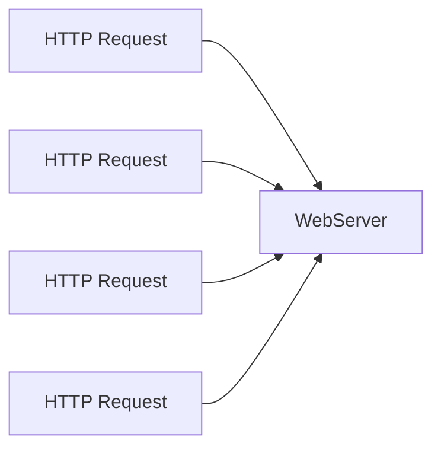
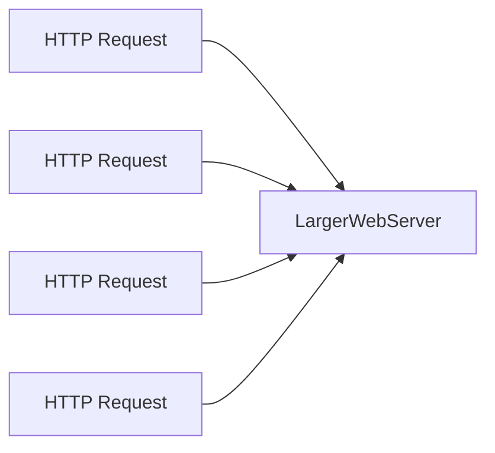
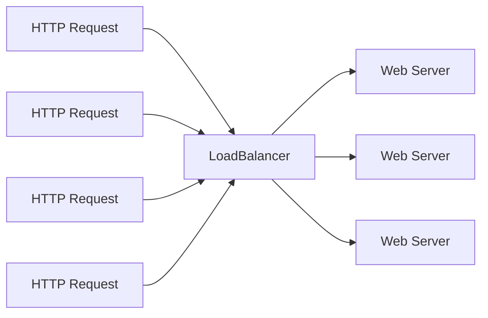
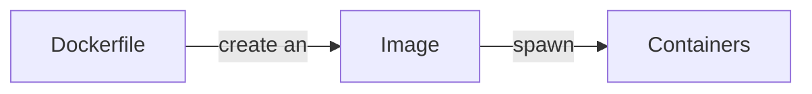
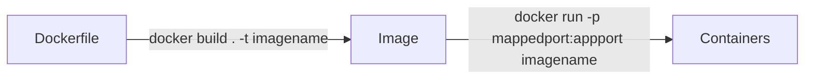

# Week 4 Review


## DevOps

- Newer term  that is a portmanteau of **Dev**elopment **Op**erations
- All software goes therough development and operation
  - Development 
    - Process of creating and testing the software
  - Operations
    - Process deploying your software and monitoring it

- **Development and Operations** meld into each other
  - Traditionally Development and Operation were different teams
  - Today there is an expectation that everyone can do a bit of both


- **Continuous Integration**
  - CI
  - Getting your code **IN** to a repo
    - Automated tests are usually run when code is put in the repo
  - As developers work on a project they centralize all their code into a shared repo other developers could use.
  - Code used to be a lot harder to maintain because you did not have centralized repos
- **Continuous Deliviery**
  - CD
  - Extenstion of CI
  - Your code after being put int the central repo is used to create a **deliverable**
    - Some artifcat of finished software
    - .jar, docker image
- **Continous Deployment**
  - CDD
  - Extension of CD
  - The deliverable is automatically deployed 

## Sonar Cloud
- CI tool for checking code quality
- **Static Code Analysis**
  - Reviews the code without running it
- It will look for bad coding practices **Code Smells**
  - Not bugs but things to improve
    - bad security
    - poor naming conventions
    - complex looking code
      - Cyclomatic Complexity
    - redundancy
    - commented out code


## Azure Services
- Azure Virtual Machine
  - A VM in the cloud you can configure however you want
  - *Disk Storage*
    - You can choose a hard drive for the VM
    - disks are stored independtly of the machine
      - You could shut down the vm but keep the disk untouched
  - *Secuity Groups/fireall rules*
    - The firewall access rules that enable traffic to reach the VM on specific port
- Container Instances
  - Deploy a container
  - bit lower level
    - less abstractions and more technical
- Container App 
  - More abstract
  - Offers automtaic load balancing and scaling
    - scale down to 0 if no no requests

## Scaling in the cloud

#### Vertical Scaling
- If there are too many HTTP Requests get a bigger container/server
  - More ram and CPUS



### Horizontal Scaling
- All requests go to a single load balancer
  - A Load Balancer is specialized computer for handling a lot of requests and forwarding them elsewhere
- The Load Balancer will direct requests to instance of the app that can handle the additional workload
- Create instances or delete instances as needed to meet demand
  - Efficient money usage
- Kill instances that have stopped working
- *In general Horizontal Load Balancing is preferred*


## Linux
- An operating system for computers
  - OS a program that runs and manages other programns
    - Widows 
    - iOS
    - Andriod
  - OS's serve as a mediator between applications running on the computer and the actual hardware resources on the computer
    - An OS will give ram or processing time for programs as needed
## Linux basics
- Most versions of linux lack any GUI
  - Everything is command line
  - No visual representations of folders or icons
  - GUIs have made you weak
- Linux if free
- Linux very light weight and minimal
  - The OS itself takes up less resources
  - You could run more programs or programs more efficiently with the same hardware
  - Great for web servers
- Linux has tremendous developer support
  - Library for everything
  - Linux distros have in-built **package managers** for installing software
    - apt
    - yum
## Docker

## The Problem
- Deploying and maintaining applications is very difficult
-  **Well it works on my machine**
- **The solution** 
  - Bundle the application and environment it runs in into a single artifact
    - That artifact is called a **Container**

## Docker Basics
- Containerization software
- **Container**
  - A virtual environment for an application to run in
  - Are very lightweight
    - Making and creating containers is on the order of seconds
  - A container runs on a computer like any other program
    - running a container is fundamentally the same to your computer as having microsoft word open
- **Image**
  - A template for a container
  - Image is to container as class is to object
- **Dockerfile**
  - A script that will create an image

### Docker lifecycle


### Docker lifecycle (commands)

- ***Dockerhub***
  - Huge repository for docker images
  - As github is to source code dockerub is to images


### Containers vs VMs

- Virtual Machines are full fleged computers
  - The hardware specs are just virtual
  - Being assigned ram and VPCs from a physical computer
  - Have their own Operating system
- Containers are lightweihgt prcoesses on a machine
  - They run just like a regular computer for the OS
  - Containers run on top of an operating system

### Example Dockerfile
```dockerfile
FROM openjdk 
# specify what the environment in my container should be

COPY . /workspace
# copy all files in the current folder and put them in a folder called workspace in the virtual environment when created

WORKDIR /workspace
# Any commands we run in our dockerfile will exucute from that location

EXPOSE 8080
# We specify what port our application runs on

ENTRYPOINT [ "java", "-jar", "Hello-App-1.0-SNAPSHOT.jar" ]
# What command will be used to to start my application
```
## Agile

# Agile 
- Mindset for approaching software Development
- **You should be agile or flexible in designing and building software**
- **Software is NOT like other types of engineering**
  - Your resources are very malleable and changeable
  - A bride engineer cannot just deice to try out a different support column 100 meters somewhere
    - Dangerous
    - Time-Consuming
    - EXPENSIVE

## Agile Tenants
- Guidelines not rules
  - Individuals and interaction over processes
  - Working software over documentation
  - Customer Collaboration over contracts
  - Respond to change vs following plan

### Waterfall
- Everything is 100% planned out from the start
  - You stick the plan never change
- Was not designed for software orginially
- Waterfall is not inherently bad for software
  - Sometimes application with strict requirements


## IaaS PaaS SaaS
- Cloud services break into 3 main categories
  - **Infrastructure as a Service**
    - Low level and you have to do a lot of manual configruation
    - IT resources and hardware
    - VMs
    - Hard Disks
  - **Platform as a service**
    - The cloud service provides a foundation for your app to build on
    - SQL Servers
      - Preconfigured VMs that were optimized for database use
    - Azure Storage Accounts
    - Container App
    - Container Instance
  - **Software as a service**
    - Completed applicaitons you can use over the web
    - gmail
    - APIs ready to use