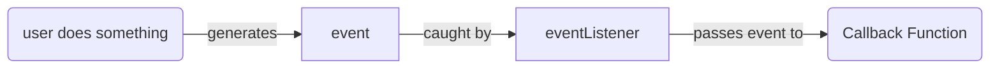

# DOM
- Document Object Model
  - Every web page behind the scenes is backed by a Document Object Model (DOM)
  - Tree of nodes representing the elements in a web page

- JavaScript was orginally for DOM Manipulation
  - Editing the nodes of tree
  - Adding a new node (element/html tag)
  - Removing nodes 

## JavaScript
- JavaScript and web pages are ***event driven***
  - Everything you can do on a web page is an event
  - Your browser records all of these events
  - These events can be sent to JavaScript functions you write for processing
- Event object contains a lot of helpful information about what happened
  - type of event (click, mouseover)
  - What element the event came from (target)
- JS is a single threaded language that can only process one event at a time
  - the vast majority of events are processed in nanoseconds
  - sometimes a snippet code might block proceeing of JS and Events
    - For instance alert stops exceution until you press okay
- The number 1 most difficult part of web pages is **State Management**
  - 

