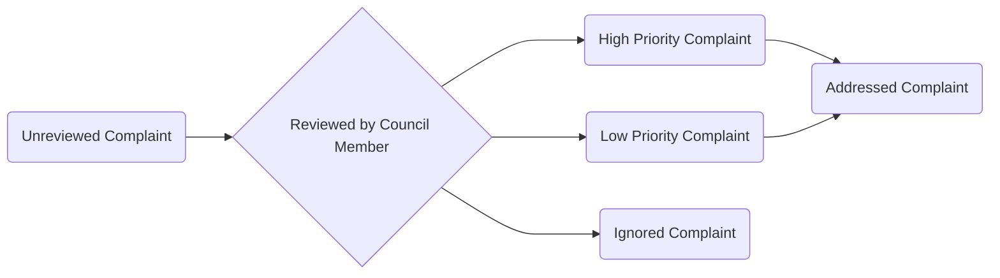

# Project 1

## Overview
You will be building a Town Complaint Submission Application for a fictional town of your choice (have fun with it!) Gotham, Smallville, Hawkins etc.... Consitutents submit complaints for issues in their town. Council members will review issues and create meetings where the complaints will be discussed. Your application will be fully hosted on Azure.

### Presentation
You will demo the application in front of the batch. Patrick and Adam will be doing the assessing. You will be sending a link to your hosted application.

### Timeline
- 8/16
  - Seperate repos created for front-end and back-end
  - Skeleton code in GitHub
  - ERD submitted and approved
- 8/22
  - Create complaint works front-end to back end
- 8/29
  - DUE

## User Stories

### Important Terminology
- Unregistered Constituent
  - Any user of the application that is not logged in
- Council Member
  - A council memeber who has logged in
- Registered Constituent
  - A constituent who has logged in
- Complaint
  - A grievance sent by a community member

#### Complaint statuses

### Primary User Stories
|As a| I Want To | So That|
|----|-----------|--------|
|Unregistered Constituent| Report Complaints | The Town Council can address them|
|Unregistered Constituent| View Meetings | I can attend meetings relavent to me |
|Council Member| Review Complaints | I can sort their priority or ignore them|
|Council Member | Create Meetings |  The town can dicuss complaints|
|Council Member | Attach complaints to meetings | contituents can attend meetings pertinent to them|

### Stretch User Stories
#### Do AFTER you have completed the primary user stories
|As a| I Want To | So That|
|----|-----------|--------|
|Unregistred Constituent| Request an account | I can access feautres available to Registered Constituent|
|Council Member | Approve Constituent Registration Request | I can verify constituent information |
|Registered Constituent| Request to speak at a specific meeting | I can voice my complaints directly|

## Deployment
- Backend must be containerized and deployed on Azure
- Database must be hosted on Azure 
- Front-end statically hosted on Azure
- Front-end code should be in a GitHub repo
- Backend-end code should be in a seperate GitHub repo
- CI tests for backend 
  - Jenkins or GitHub actions

## Technical Requirements
- All DAO methods tested
- Service methods with bussiness logic should be tested using Mockito
- Logging 
- Backend built using Javalin
- Front-end using HTML/CSS/JS