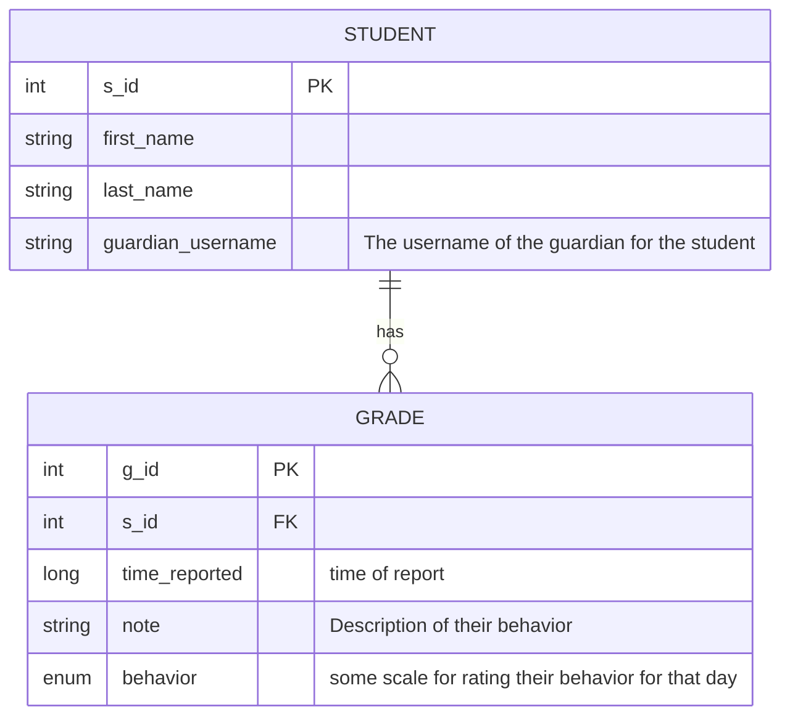
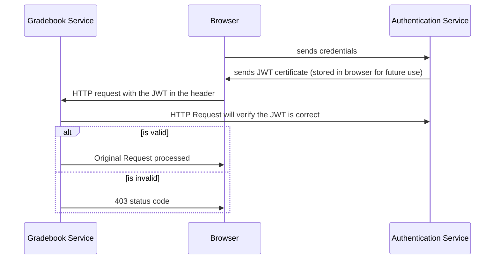

# Project 2

## Description
You will be creating a full stack application in a team of 4. You will be making the an Online Report Card System for a daycare of your choice. Can be real or fictional, examples... Hawkins High School, Hogwarts etc.. Teachers can make these report cards as often as they like. Guardians can only see grades for their particular student.

## Technical Description
Your application will be a **Micro-Services** Application. This is when a single application is supported by multiple different backend APIs that run independently. 

- **Authentication Service**
  - This service will allow a person to send an HTTP Request containing their username and password.
  - The Authentication service will return a JWT containing their username and role
  - This Micro-Service uses a MongoDB Database for its user information
  - You do not need functionality for creating or updating users
  - This service will publish a message to the *Important Event  Queue* with the time of login and the user

- **Gradebook REST Service**
    - This Service is a REST API for managing students and grades
    - When a student is added or deleted a message is sent to the *Important Event Queue* with the name of the student added or deleted
- **Important-Event Service**
  - This service would read messages from the *Imporant Event Queue* and save them to a database
    - Not required to build because it is not free tier on Azure
  - This service has no front-end functionality and is for auditing purposes 

### Tips
- Do Authentication LAST
  - Build your app in features knowing that HTTP requests can be validated safely at a later point

### Primary User Stories
##### Completeable with Angular and just Gradebook REST Service
|As a| I Want To | So That|
|----|-----------|--------|
|Teacher| add students |I can track the students int the day care|
|Teacher| delete students |Remove students no longer in daycare|
|Teacher| add grades |I can track student behavior|
|Teacher| delete grades |fix mistakes and recreate a grad|
|Teacher| search for student by name | easily find someone |
|Teacher| View grades for a student|Measure their progress|

### Secondary User Stories
##### Requires a working Authentication Service
|As a| I Want To | So That|
|----|-----------|--------|
|Teacher| login |so that I can validate my actions|
|Guardian| login |I can view grades for my student|

### Example ERD For Gradebook Service

### Authentication Worflow

## Deployment
- Backend must be containerized and deployed on Azure
- Postgres Database must be hosted on Azure 
- NoSQL database using MongoDB Atlas 
- Front-end statically hosted on Azure
- Front-end code should be in a GitHub repo
- Backend-end code should be in a seperate GitHub repo
- CI tests for backend 
  - Jenkins or GitHub actions
- SonarCloud for repositories

## Technical Requirements
- All custom queries in Spring Data tested
- Service methods with bussiness logic should be tested using Mockito
- Logging 
- Spring Boot on the backend
- Angular at the frontend
